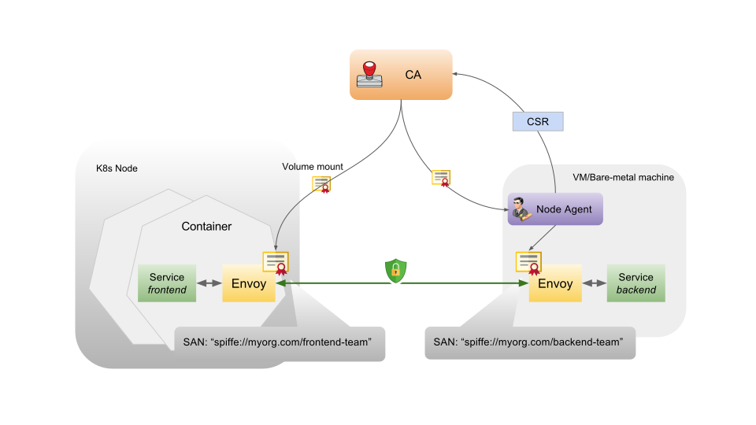

#  Securing Serverless Functions via Kubernetes Objects

* Sebastien Goasguen, Bitnami, @sebgoa
* kompose, Cabin, kmachine, LF certification course ...
* Now at Bitnami (Charts, kubeapps, kubecfg, sealed-secrets)
* Apps, Apps, Apps...on any platform

* Johannes Engelke, SAP Hybris, @quablab

---

## Kubeless

* [kubeless.io](http://kubeless.io)
* [https://github.com/kubeless/kubeless](https://github.com/kubeless/kubeless)

Open Source

* [https://github.com/kubeless](https://github.com/kubeless)

---

## What type of Apps

* Cloud Events based distributed apps
* Composed of many different services triggered by events
* _AWS Lambda Clone_
* Google Cloud functions like CLI
* Same realm as Apache OpenWhisk, Fission, Nuclio, OpenFaaS, Fn ...

---

## Serverless

Serverless support for kubeless

`sls create --template kubeless-python --path mypythonfunction`

`sls create --template kubeless-nodejs --path mynodefunction`

* [https://serverless.com](https://serverless.com)

---

## kubeless

* Kubernetes extension
* CRD for `functions`
* A controller (actually several)
* Creates deployments, services
* Creates Ingress if needed
* Uses Configmap and build system
* Instrumented runtimes with `prometheus-client`
* A `serverless` Plugin
* Custom metrics HPA
* Support for CloudEvents (see Austen's talk)

---

## Original Architecture

---

## Current Architecture in v1.0.0-alpha.1

---

## Security of Functions

* Internal security
* External security

Internal Security:

* Authentication / Authorization for who can CRUD functions where
* Audit function creation
* Log function
* Limit what a compromised function could do

External Security:

* Mostly authentication issue for now
* Who can call functions (e.g Ingress auth)
* Who can a function call (e.g Function auth to an external service)

---

## Authn/Authz

---

## Security Context

---

## Security Account for functions

---

## Quota ?

---

## Network Policies

---
## External Security:

* Mostly authentication issue for now
* Who can call functions (e.g Ingress auth)
* Who can a function call (e.g Function auth to an external service)

---

## Demo

Thank you,

- @sebgoa

Please Welcome Johannes Engelke,

---

## Istio

An open platform to connect, manage, and secure microservices

    

---

## Demo Architecture

- etcd
- Product-Service and Comments Function
- Web UI

---

## MutualTLS

    

---

## JWT & RBAC

- Secure comments using JWT
- Use RBAC for authorisation

---

## Summary

- Limitations

    - Mutual TLS
    - Health Checks
    - CLI

---
 
## Conclusions
 
* Kubernetes provides several API objects to secure functions

* Better Pod identity is needed to access Cloud Services

* Cloud Specific controllers will help tie functions to other services

* Service Binding can be leveraged to authenticate to services from functions.

* Istio brings additional security objects
 
* @sebgoa
* @quablab